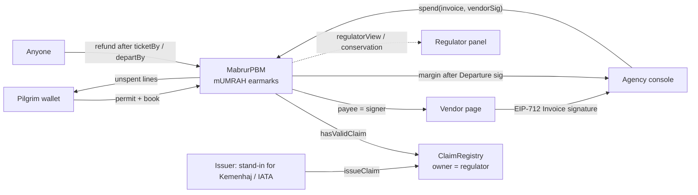

<div align="center">
  
  <h1>Mabrur 🕋</h1>
  <p><a href="README.md">Bahasa Indonesia</a> · <strong>English</strong></p>
  <p><em>A pilgrim's money is held in trust, not the agency's working capital.<br/>Each pilgrim's prepaid rupiah is earmarked onchain, line by line, payable only to verified vendors, and refundable by anyone.</em></p>
  <p>The First Travel case: 63,310 prospective pilgrims defrauded, IDR 905 billion lost (<a href="https://megapolitan.kompas.com/read/2023/01/05/15482901/aset-first-travel-dirampas-negara-mahkamah-agung-putuskan-dikembalikan-ke">Kompas, 5 Jan 2023</a>).</p>
  

  <br/>

  [](https://mabrur.edycu.dev)
  [](https://mabrur.edycu.dev/pitch)
  [](https://youtu.be/fcSKl9-3VJk)
  [](https://youtu.be/2xBHUcz45OU)
  [](https://www.hackquest.io/projects/Mabrur)

  <br/>

  [](DEMO.md)
  [](https://arbiscan.io/address/0x36f1d899d9d4411b2DdfB60Dbbe989220336d2D5#code)
  [](https://www.hackquest.io/hackathons/Ethereum-Jakarta-Hackathon-2026)

  <br/>

  
  
  
  
  
  [](https://github.com/edycutjong/mabrur/actions/workflows/ci.yml)
  [](https://github.com/edycutjong/mabrur/releases/latest)

</div>

---

## 📸 See it in action

> **One booking, four attempts.** The agency tries Siti's hotel invoice on Ahmad's money (**EarmarkMismatch**), tries
> to pay the director (**VendorClaimMissing**), pays the airline (✔ Rp 14.000.000 to the invoice signer), reaches for
> its fee before departure (**NotDeparted**). Siti's ticket-by date passes with no ticket bought, and **anyone** taps
> refund: every unspent rupiah goes back to her.

Every one of those attempts is a **mined transaction on Arbitrum One**: the three rejections are failed transactions
you can open on Arbiscan, decoded by name. See [DEMO.md](DEMO.md) for the full ledger.

| Agency attempt (on chain) | Result | Tx |
|---|---|---|
| Siti's hotel invoice on a booking of Pak Ahmad's | `EarmarkMismatch` | [0x9ed30e38…](https://arbiscan.io/tx/0x9ed30e3802f988fb2219a08c9d184ab779da13d2afbc7f9314d0ab3fa0bbc316) |
| Invoice signed by the agency director | `VendorClaimMissing` | [0x887d6b86…](https://arbiscan.io/tx/0x887d6b86d4361666b883edb9624efbd9bef0cdc6e4b0244149433d964beffa61) |
| Replaying an invoice that was already paid | `InvoiceReplayed` | [0x952f30ad…](https://arbiscan.io/tx/0x952f30adf9d7cc08982d8128c5e0de85a241d92a2d0e099799df6c7a75b9619a) |
| Agency signs its own "departure" to take the fee | `NotDeparted` | [0xe4855ebd…](https://arbiscan.io/tx/0xe4855ebd72f05a8756a814cc8fbfb963b18f70bdd16856130cff391e1df5291b) |
| Airline invoice, Rp 14.000.000 | paid to the signer | [0x7bb513e7…](https://arbiscan.io/tx/0x7bb513e7aa166844f26b49c2b94deb2b70ca62904de5b8afdaf23b114ac10590) |
| Siti's ticket-by lapses, a third party calls `refund` | Rp 23.000.000 back to Siti | [0x13b8a133…](https://arbiscan.io/tx/0x13b8a1335b64ebaaef1a2e22de87c91f4c13604d224e2f06a3dcf51ca3f78666) |

---

## 💡 The problem & the solution

Umrah is prepaid, often months ahead, to a licensed travel agency (PPIU). When an agency treats that money as working
capital, new pilgrims pay for earlier pilgrims' trips until it collapses:

- **First Travel:** 63,310 prospective pilgrims, IDR 905 billion lost ([Kompas, 5 Jan 2023](https://megapolitan.kompas.com/read/2023/01/05/15482901/aset-first-travel-dirampas-negara-mahkamah-agung-putuskan-dikembalikan-ke)); new sign-ups were allegedly funding earlier departures ([detik, 24 Jul 2017](https://finance.detik.com/moneter/d-3571069/first-travel-diduga-pakai-skema-ponzi-apa-itu)).
- **Abu Tours:** 86,720 pilgrims, an estimated IDR 1.8 trillion ([Kompas, 29 Jan 2019](https://regional.kompas.com/read/2019/01/29/13221841/5-fakta-vonis-20-tahun-bos-abu-tour-tipu-86720-jemaah-umrah-hingga-30-kali?page=all)).
- **Scale:** about 1.4 million pilgrims departed through licensed agencies (PPIU) in 2024 (SISKOPATUH data as reported by [HIMPUH, 18 Feb 2025](https://himpuh.or.id/blog/detail/2307/himpuh-400-ribu-jemaah-indonesia-berangkat-umrah-tidak-lewat-ppiu-di-tahun-2024); secondary source).

**Mabrur** makes the pilgrim's prepayment a **real-world asset she holds**: a non-transferable claim on a licensed
service (`mUMRAH`), split into FLIGHT · HOTEL · VISA · MARGIN lines. The agency can move money only one way.

**Key features (all in [`MabrurPBM.sol`](packages/foundry/contracts/MabrurPBM.sol)):**
- 🧾 **Per-pilgrim earmarks:** one EIP-2612 permit signature plus `book()` wraps her rupiah into her own booking. `_update` blocks every transfer, so one pilgrim's money can never pay for another's trip ([`MabrurPBM.sol:241`](packages/foundry/contracts/MabrurPBM.sol#L241)).
- ✍️ **Nobody chooses the payee:** `spend()` pays the **EIP-712 invoice signer**, and only if that signer holds a valid AIRLINE / HOTEL / VISA claim in the [`ClaimRegistry`](packages/foundry/contracts/ClaimRegistry.sol). There is no address field for the agency to type its director into ([`MabrurPBM.sol:162`](packages/foundry/contracts/MabrurPBM.sol#L162)).
- 🛫 **Fee after departure:** the agency's MARGIN (capped at 20 %) unlocks only on a `Departure` signature from the pilgrim, or from the licensed airline paid from her FLIGHT line ([`MabrurPBM.sol:197`](packages/foundry/contracts/MabrurPBM.sol#L197)).
- 🎫 **"Tiket lunas atau sisa dana kembali" (a paid ticket, or the rest of the money back):** if no full ticket is paid by the pilgrim-signed `ticketBy` date, or once `departBy` passes, **anyone** (a neighbour, an NGO, the regulator) can call `refund()` and every unspent rupiah returns to her ([`MabrurPBM.sol:218`](packages/foundry/contracts/MabrurPBM.sol#L218)). `book` also rejects a departure date more than 180 days out.
- 🏛️ **Live regulator view:** `regulatorView(agency)` (open bookings, liabilities from an independent deposited − paid-out ledger, earmarked) and `conservation()` show that outstanding prepayments are backed by rupiah held in the contract.
- 🔑 **No override key:** no owner, pause or upgrade path touches balances. The registry owner (the regulator key, never the agency) only decides who counts as a vendor.

### Why not a bank escrow account or a milestone-escrow contract?

| | Bank escrow (*rekening penampungan*) | Milestone escrow (the default build) | **Mabrur** |
|---|---|---|---|
| Per-pilgrim separation | one pooled account | one pool or per deal | per-booking earmark, enforced in the token |
| Who picks the payee | agency instructs the bank | agency names an address | **nobody**: the claim-verified invoice signer |
| Fee before service | agency withdraws at will | at an agency-declared milestone | locked until departure is signed |
| Agency disappears | court process, years | needs an arbiter | `refund()` by anyone, no cooperation needed |
| Regulator view | after collapse, by audit | none | live, from contract state |


### Compared with existing RWA solutions

- **[Centrifuge](https://github.com/centrifuge/protocol), [Ondo](https://docs.ondo.finance/), [Securitize](https://github.com/securitize-io/DSTokenInterfaces)** tokenize **investors'** assets (credit, bonds, funds). Mabrur protects **consumers'** prepaid money: pilgrims' funds already paid for a service not yet delivered.
- **MAS Project Orchid** (Singapore) tested *purpose-bound money* for vouchers and payments ([MAS, 31 Oct 2022](https://www.mas.gov.sg/news/media-releases/2022/mas-report-on-potential-uses-of-a-purpose-bound-digital-singapore-dollar)). Mabrur applies that purpose-bound pattern to consumer prepayments: separated per pilgrim, payable only to claim-verified vendors, and refundable by anyone if no ticket is paid.

---

## 🏗️ Architecture & tech stack



| Layer | Technology |
|---|---|
| Contracts | Solidity `^0.8.24`, compiled and verified with solc 0.8.33; OpenZeppelin 5.6.1 (`ERC20Wrapper`, `ERC20Permit`, `EIP712`, `ECDSA`, `ReentrancyGuard`) |
| Chain | **Arbitrum One (42161)**, all three contracts verified on Arbiscan |
| Tooling | Foundry (unit, fuzz, invariant, scripts broadcasting to mainnet) |
| App | Scaffold-ETH 2: Next.js App Router, wagmi + viem, RainbowKit; decoded custom errors via `simulateContract` |
| Money | `tIDR`: an ERC20Permit **test rupiah with no monetary value**, `decimals = 0` |

| Contract | Address (Arbitrum One) |
|---|---|
| MabrurPBM | [`0x36f1d899d9d4411b2DdfB60Dbbe989220336d2D5`](https://arbiscan.io/address/0x36f1d899d9d4411b2DdfB60Dbbe989220336d2D5#code) |
| ClaimRegistry | [`0xd5B731CD0f2c91D5D64b59d9E4a2A4E4b6315ADb`](https://arbiscan.io/address/0xd5B731CD0f2c91D5D64b59d9E4a2A4E4b6315ADb#code) |
| TIDR (test token) | [`0x66F838be32A624f4C797483a151C7f6209A43448`](https://arbiscan.io/address/0x66F838be32A624f4C797483a151C7f6209A43448#code) |

**What it costs per pilgrim** (from the real receipts, `script/cost.sh`): a full departed lifecycle (book + 3 vendor
payments + margin release) used **907,185 gas ≈ Rp 809**, and a refunded one (book + 1 payment + refund)
**582,938 gas ≈ Rp 520**, at ETH/IDR 44,563,294 (CoinGecko, 2026-10-09 04:32 UTC). That is about 0.0025 % of a
Rp 32.000.000 package.

---

## 🚀 Getting started

**For judges, no install:** open **[mabrur.edycu.dev](https://mabrur.edycu.dev)** (or go straight to
[/judge](https://mabrur.edycu.dev/judge)). Reads work with no wallet.
- `/app/jamaah`: look up a booking by pilgrim address or id and see each line's state from chain.
- `/app/agen`: press **Load sample invoices** (or paste / pick a signed invoice file), press **Simulate only**, and get the decoded verdict from Arbitrum One without a wallet. The sample is [`/demo/invoices.json`](https://mabrur.edycu.dev/demo/invoices.json); `/app/agen?contoh=1` loads it on arrival. The regulator panel is on the right.
- `/app/vendor`: sign an `Invoice` with a burner key and paste it into the console.

**Run it yourself:**
```bash
git clone --recursive https://github.com/edycutjong/mabrur.git && cd mabrur
yarn install
cd packages/foundry && forge test          # 87 tests: unit, fuzz, invariant
cd ../.. && yarn chain                     # local anvil (terminal 1)
yarn deploy                                # deploy + generate ABIs (terminal 2)
NEXT_PUBLIC_LOCAL_CHAIN=true yarn start    # app on localhost:3000 (terminal 3)
```
Replaying the Arbitrum One demo (`script/run.sh SeedDemo`, `script/proof.sh`) needs the role keys in
`~/.config/mabrur/keys.env`; they are never in this repo.

---

## 🧪 Testing & proof

| What | Result |
|---|---|
| `forge test` | **87 tests, 0 failed, 100 % line · branch · function coverage on all three contracts**: every custom error has a test; regression tests are named after the defect they pin (e.g. `test_ReAddedIssuerDoesNotResurrectOldClaims`) |
| Invariant suite | **7 invariants** × 256 runs × depth 100: Σ earmarks == `mUMRAH` supply == tracked total; tIDR held == supply + donations; per-booking and per-agency ledgers balance; no payment ever reaches an unclaimed address; no spend after a booking turns refundable; after warping past every deadline and refunding, supply is 0 |
| T1 bound | `test_CaptureIssuer_Bound`: even a captured issuer cannot take more than the unexpired FLIGHT+HOTEL+VISA lines; the margin only ever goes to the agency |
| Mined reverts | 4 adversarial attempts mined on Arbitrum One, each replayed by `script/proof.sh` and required to decode to the expected error |
| Reviews | 3 internal adversarial review rounds of the contracts: no High or Medium findings; four Low ClaimRegistry issues (issuer overwrite, issuer re-add, topic narrowing, expired-claim blocking) were fixed with regression tests; round 3 found nothing new ([review log](docs/AUDIT.md)) |

| Layer | Tool |
|---|---|
| Contracts | `forge fmt --check`, `forge test` (unit, fuzz, invariant), `forge coverage` in CI |
| Frontend | ESLint (0 warnings), `tsc` type check, Next.js production build, Vitest unit tests with 100 % per-file coverage (CI gate), Playwright E2E |
| Security | CodeQL, Dependabot alerts + grouped updates, gitleaks over full history, GitHub secret scanning + push protection |
| Releases | semantic versions from conventional commits (`release.yml`); automatic Vercel deploy after every gate passes |

---

## ⚖️ Trust assumptions & honest limits

- **T1 · registry integrity.** The registry owner is the regulator key, never the agency. A captured owner or issuer could certify the director as a vendor; the damage is bounded (`test_CaptureIssuer_Bound`) and visible on chain.
- **T2 · vendor honesty.** A licensed vendor could sign an invoice for less service than billed. `spend` blocks the agency's own address (`SelfDealing`) but cannot see corporate affiliation; each payment is capped by that booking's line.
- **T3 · departure co-signer.** The one airline paid from the FLIGHT line can co-sign departure. The FLIGHT invoice must pay the **whole** FLIGHT line, so a token "Rp 1 ticket" cannot switch off the ticket-by refund (`test_Spend_RevertsFlightNotFullyPaid_Rp1TicketIsNotATicket`).
- **T4 · pilgrim key custody.** If the agency holds the pilgrim's key, it can sign for her. Production path: a passkey / smart-account wallet issued by her bank or onramp, never the agency.
- **The money is a test token.** Bank Indonesia does not permit crypto as a payment instrument ([ANTARA, 15 Jun 2021](https://www.antaranews.com/berita/2211790/bi-larang-lembaga-keuangan-gunakan-uang-kripto-untuk-alat-pembayaran)). The production rail is a licensed rupiah token (a bank tokenized deposit or Digital Rupiah) plus a regulator mandate for PPIU deposits; neither exists today. The wrapper takes any plain ERC-20.
- **No seat guarantee.** Seats depend on airlines and visa quota. Mabrur guarantees *a paid ticket, or every unspent rupiah back* by a date the pilgrim signed.
- The issuer key stands in for Kemenhaj (Indonesia's Ministry of Hajj and Umrah, which licenses and supervises PPIU under [Law 14/2025](https://pasal.id/peraturan/uu/uu-no-14-tahun-2025) and Ministerial Regulation 2/2026; [RRI, 6 Aug 2026](https://rri.co.id/bengkalis/info-kementerian/2631886/kemenhaj-perkuat-pengawasan-ppiu-demi-lindungi-jemaah-umrah)) / IATA, and all names in the demo ("PT Amanah Contoh Wisata", "PT Contoh GSA") are fictional.

---

## 📁 Project structure
```
mabrur/
├── packages/foundry/
│   ├── contracts/        # MabrurPBM, ClaimRegistry, TIDR
│   ├── test/             # unit + fuzz, invariant suite, coverage tests
│   ├── script/           # Deploy, Setup, SeedDemo, DemoRun, DemoRefund, proof.sh, cost.sh, ledger.py
│   └── broadcast/        # committed Arbitrum One receipts (DEMO.md is generated from them)
├── packages/nextjs/app/app/
│   ├── jamaah/           # pilgrim passbook: book with permit, departure signature, refund
│   ├── agen/             # agency console: invoice loader, decoded-revert stamps, regulator panel
│   └── vendor/           # vendor invoice signer (EIP-712)
├── DEMO.md               # every step as an Arbiscan link
├── JUDGE.md              # the 30-second path for judges
└── .github/              # CI, CodeQL, gitleaks, Dependabot, release
```

## 📄 License
[MIT](LICENSE) © 2026 Edy Cu. Built on [Scaffold-ETH 2](https://scaffoldeth.io) (MIT, BuidlGuidl).

## 🙏 Acknowledgments
Built for **Ethereum Jakarta Hackathon 2026** (ETHJKT × HackQuest), track *Build the Real World Onchain*.
Thanks to the ETHJKT mentors and organizers, OpenZeppelin, Foundry and Scaffold-ETH 2.

**How it was built.** Built solo with an AI coding agent (Claude Code) from a design spec written before the sprint; all code was committed after 10:00 WIB on 9 Oct 2026 (first commit `6837308`, 10:38 WIB). The full commit history is in this repo.
