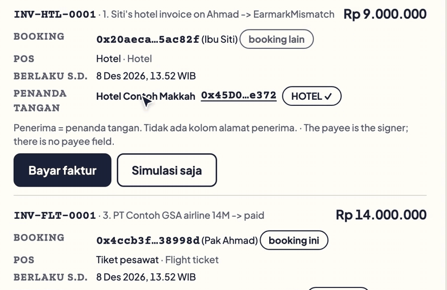
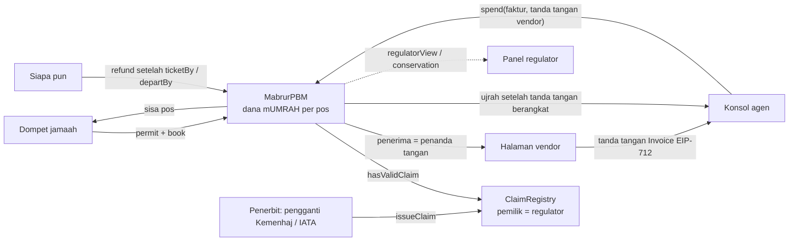

<div align="center">
  
  <h1>Mabrur 🕋</h1>
  <p><strong>Bahasa Indonesia</strong> · <a href="README.en.md">English</a></p>
  <p><em>Dana jamaah adalah amanah, bukan modal kerja agen.<br/>Setiap rupiah uang muka jamaah dikunci onchain per pos, hanya bisa dibayarkan ke vendor terverifikasi, dan bisa dikembalikan oleh siapa pun.</em></p>
  <p>Kasus First Travel: 63.310 calon jamaah jadi korban, kerugian Rp 905 miliar (<a href="https://megapolitan.kompas.com/read/2023/01/05/15482901/aset-first-travel-dirampas-negara-mahkamah-agung-putuskan-dikembalikan-ke">Kompas, 5 Jan 2023</a>).</p>
  

  <br/>

  [](https://mabrur.edycu.dev)
  [](https://mabrur.edycu.dev/pitch)
  [](https://youtu.be/fcSKl9-3VJk)
  [](https://youtu.be/2xBHUcz45OU)
  [](https://www.hackquest.io/projects/Mabrur)
  [](DEMO.md)
  [](https://arbiscan.io/address/0x36f1d899d9d4411b2DdfB60Dbbe989220336d2D5#code)
  [](https://www.hackquest.io/hackathons/Ethereum-Jakarta-Hackathon-2026)

  <br/>

  
  
  
  
  
  [](https://github.com/edycutjong/mabrur/actions/workflows/ci.yml)
  [](https://github.com/edycutjong/mabrur/releases/latest)

</div>

---

## 📸 Lihat cara kerjanya

<p align="center"></p>
<p align="center"><sub>Rekaman layar asli dari konsol agen: <b>Simulasi saja</b> adalah panggilan nyata ke kontrak tanpa mengirim transaksi. Versi EarmarkMismatch yang benar-benar ditambang ada di baris pertama tabel di bawah.</sub></p>

> **Satu booking, empat percobaan.** Agen mencoba memakai faktur hotel Ibu Siti dengan dana Pak Ahmad
> (**EarmarkMismatch**), mencoba membayar direkturnya sendiri (**VendorClaimMissing**), membayar maskapai (✔ Rp 14.000.000
> ke penanda tangan faktur), lalu mencoba mengambil ujrah sebelum jamaah berangkat (**NotDeparted**). Batas tiket
> Ibu Siti lewat tanpa tiket dibeli, dan **siapa pun** bisa menekan refund: setiap rupiah yang belum terpakai kembali
> kepadanya.

Setiap percobaan itu adalah **transaksi yang benar-benar ditambang di Arbitrum One**: tiga penolakan di bawah adalah
transaksi gagal yang bisa dibuka di Arbiscan, lengkap dengan nama error-nya. Buku besar lengkap ada di [DEMO.md](DEMO.md).

| Percobaan agen (onchain) | Hasil | Tx |
|---|---|---|
| Faktur hotel Ibu Siti dipakai pada booking Pak Ahmad | `EarmarkMismatch` | [0x9ed30e38…](https://arbiscan.io/tx/0x9ed30e3802f988fb2219a08c9d184ab779da13d2afbc7f9314d0ab3fa0bbc316) |
| Faktur yang ditandatangani direktur agen | `VendorClaimMissing` | [0x887d6b86…](https://arbiscan.io/tx/0x887d6b86d4361666b883edb9624efbd9bef0cdc6e4b0244149433d964beffa61) |
| Mengirim ulang faktur yang sudah dibayar | `InvoiceReplayed` | [0x952f30ad…](https://arbiscan.io/tx/0x952f30adf9d7cc08982d8128c5e0de85a241d92a2d0e099799df6c7a75b9619a) |
| Agen menandatangani "keberangkatan" sendiri untuk mengambil ujrah | `NotDeparted` | [0xe4855ebd…](https://arbiscan.io/tx/0xe4855ebd72f05a8756a814cc8fbfb963b18f70bdd16856130cff391e1df5291b) |
| Faktur maskapai, Rp 14.000.000 | dibayar ke penanda tangan | [0x7bb513e7…](https://arbiscan.io/tx/0x7bb513e7aa166844f26b49c2b94deb2b70ca62904de5b8afdaf23b114ac10590) |
| Batas tiket Ibu Siti lewat, pihak ketiga memanggil `refund` | Rp 23.000.000 kembali ke Ibu Siti | [0x13b8a133…](https://arbiscan.io/tx/0x13b8a1335b64ebaaef1a2e22de87c91f4c13604d224e2f06a3dcf51ca3f78666) |

---

## 💡 Masalah & solusinya

Umrah dibayar di muka, sering berbulan-bulan sebelumnya, kepada biro perjalanan berizin (PPIU). Ketika agen
memperlakukan dana itu sebagai modal kerja, jamaah baru membiayai keberangkatan jamaah lama sampai semuanya runtuh:

- **First Travel:** 63.310 calon jamaah, kerugian Rp 905 miliar ([Kompas, 5 Jan 2023](https://megapolitan.kompas.com/read/2023/01/05/15482901/aset-first-travel-dirampas-negara-mahkamah-agung-putuskan-dikembalikan-ke)); pendaftar baru diduga membiayai keberangkatan jamaah sebelumnya ([detik, 24 Jul 2017](https://finance.detik.com/moneter/d-3571069/first-travel-diduga-pakai-skema-ponzi-apa-itu)).
- **Abu Tours:** 86.720 jamaah, perkiraan kerugian Rp 1,8 triliun ([Kompas, 29 Jan 2019](https://regional.kompas.com/read/2019/01/29/13221841/5-fakta-vonis-20-tahun-bos-abu-tour-tipu-86720-jemaah-umrah-hingga-30-kali?page=all)).
- **Skala:** sekitar 1,4 juta jamaah berangkat melalui PPIU pada 2024 (data SISKOPATUH sebagaimana dilaporkan [HIMPUH, 18 Feb 2025](https://himpuh.or.id/blog/detail/2307/himpuh-400-ribu-jemaah-indonesia-berangkat-umrah-tidak-lewat-ppiu-di-tahun-2024); sumber sekunder).

**Mabrur** menjadikan uang muka jamaah sebuah **aset dunia nyata yang ia pegang sendiri**: klaim atas layanan berizin
yang tidak bisa dipindahtangankan (`mUMRAH`), dipecah menjadi pos TIKET · HOTEL · VISA · UJRAH. Agen hanya punya satu
jalan untuk memindahkan uang.

**Fitur utama (semuanya di [`MabrurPBM.sol`](packages/foundry/contracts/MabrurPBM.sol)):**
- 🧾 **Dana dipisah per jamaah:** satu tanda tangan permit EIP-2612 ditambah `book()` membungkus rupiahnya ke dalam booking miliknya sendiri. `_update` memblokir setiap transfer, sehingga dana satu jamaah tidak pernah bisa membiayai perjalanan jamaah lain ([`MabrurPBM.sol:241`](packages/foundry/contracts/MabrurPBM.sol#L241)).
- ✍️ **Tidak ada yang memilih penerima:** `spend()` membayar **penanda tangan faktur EIP-712**, dan hanya jika penanda tangan itu memegang klaim AIRLINE / HOTEL / VISA yang sah di [`ClaimRegistry`](packages/foundry/contracts/ClaimRegistry.sol). Tidak ada kolom alamat yang bisa diisi agen dengan alamat direkturnya ([`MabrurPBM.sol:162`](packages/foundry/contracts/MabrurPBM.sol#L162)).
- 🛫 **Ujrah setelah berangkat:** ujrah agen (maksimal 20 %) baru terbuka dengan tanda tangan `Departure` dari jamaah, atau dari maskapai berizin yang dibayar dari pos tiketnya ([`MabrurPBM.sol:197`](packages/foundry/contracts/MabrurPBM.sol#L197)).
- 🎫 **"Tiket lunas atau sisa dana kembali":** jika tiket tidak dibayar lunas sebelum `ticketBy` yang ditandatangani jamaah, atau setelah `departBy` lewat, **siapa pun** (tetangga, LSM, regulator) bisa memanggil `refund()` dan setiap rupiah yang belum terpakai kembali ke jamaah ([`MabrurPBM.sol:218`](packages/foundry/contracts/MabrurPBM.sol#L218)). `book` juga menolak tanggal berangkat lebih dari 180 hari ke depan.
- 🏛️ **Pandangan regulator secara langsung:** `regulatorView(agency)` (booking terbuka, kewajiban dari buku besar setoran − pembayaran yang independen, dana tersimpan) dan `conservation()` menunjukkan bahwa seluruh uang muka yang belum terpakai dijamin rupiah yang ada di kontrak.
- 🔑 **Tanpa kunci darurat:** tidak ada owner, pause, atau jalur upgrade yang bisa menyentuh saldo. Pemilik registry (kunci regulator, tidak pernah agen) hanya menentukan siapa yang diakui sebagai vendor.

### Mengapa bukan rekening penampungan bank atau kontrak escrow bertahap?

| | Rekening penampungan bank | Escrow bertahap (pendekatan umum) | **Mabrur** |
|---|---|---|---|
| Pemisahan per jamaah | satu rekening gabungan | satu kolam atau per transaksi | dana per booking, ditegakkan di token |
| Siapa memilih penerima | agen memberi instruksi ke bank | agen menulis alamat | **tidak ada**: penanda tangan faktur yang terverifikasi |
| Ujrah sebelum layanan | agen menarik kapan saja | pada tahap yang ditentukan agen | terkunci sampai keberangkatan ditandatangani |
| Agen menghilang | proses pengadilan, bertahun-tahun | butuh arbiter | `refund()` oleh siapa pun, tanpa kerja sama agen |
| Pandangan regulator | setelah runtuh, lewat audit | tidak ada | langsung, dari state kontrak |


### Dibanding solusi RWA yang sudah ada

- **[Centrifuge](https://github.com/centrifuge/protocol), [Ondo](https://docs.ondo.finance/), [Securitize](https://github.com/securitize-io/DSTokenInterfaces)** menokenisasi aset milik **investor** (kredit, obligasi, dana). Mabrur melindungi uang muka milik **konsumen**: dana jamaah yang sudah dibayar untuk layanan yang belum diterima.
- **MAS Project Orchid** (Singapura) menguji *purpose-bound money* untuk voucher dan pembayaran ([MAS, 31 Okt 2022](https://www.mas.gov.sg/news/media-releases/2022/mas-report-on-potential-uses-of-a-purpose-bound-digital-singapore-dollar)). Mabrur menerapkan pola uang berbatas-tujuan itu pada uang muka konsumen: dipisah per jamaah, dibayar hanya ke vendor yang klaimnya terverifikasi, dan dikembalikan oleh siapa pun bila tiket tidak lunas.

---

## 🏗️ Arsitektur & teknologi



| Lapisan | Teknologi |
|---|---|
| Kontrak | Solidity `^0.8.24`, dikompilasi & diverifikasi dengan solc 0.8.33; OpenZeppelin 5.6.1 (`ERC20Wrapper`, `ERC20Permit`, `EIP712`, `ECDSA`, `ReentrancyGuard`) |
| Chain | **Arbitrum One (42161)**, ketiga kontrak terverifikasi di Arbiscan; salinan di testnet **Arbitrum Sepolia (421614)** untuk dicoba siapa saja |
| Tooling | Foundry (unit, fuzz, invariant, skrip yang di-broadcast ke mainnet) |
| Aplikasi | Scaffold-ETH 2: Next.js App Router, wagmi + viem, RainbowKit; error kontrak didekode lewat `simulateContract` |
| Uang | `tIDR`: rupiah uji ERC20Permit **tanpa nilai moneter**, `decimals = 0` |

| Kontrak | Alamat (Arbitrum One) |
|---|---|
| MabrurPBM | [`0x36f1d899d9d4411b2DdfB60Dbbe989220336d2D5`](https://arbiscan.io/address/0x36f1d899d9d4411b2DdfB60Dbbe989220336d2D5#code) |
| ClaimRegistry | [`0xd5B731CD0f2c91D5D64b59d9E4a2A4E4b6315ADb`](https://arbiscan.io/address/0xd5B731CD0f2c91D5D64b59d9E4a2A4E4b6315ADb#code) |
| TIDR (token uji) | [`0x66F838be32A624f4C797483a151C7f6209A43448`](https://arbiscan.io/address/0x66F838be32A624f4C797483a151C7f6209A43448#code) |

| Kontrak | Alamat (Arbitrum Sepolia, testnet) |
|---|---|
| MabrurPBM | [`0xa2BC8c2959b1c9d5A90B750aCFfbD52181CE98f1`](https://sepolia.arbiscan.io/address/0xa2BC8c2959b1c9d5A90B750aCFfbD52181CE98f1#code) |
| ClaimRegistry | [`0xCbf1247e292B8eA0bA151a1b5811B732Fc564480`](https://sepolia.arbiscan.io/address/0xCbf1247e292B8eA0bA151a1b5811B732Fc564480#code) |
| TIDR (token uji) | [`0xc56c5561fc65274c55419FC031D90f68AE854B4B`](https://sepolia.arbiscan.io/address/0xc56c5561fc65274c55419FC031D90f68AE854B4B#code) |

**Coba sendiri di testnet.** Tombol **Mainnet | Testnet** di header aplikasi memindahkan aplikasi ke Arbitrum Sepolia, dengan kontrak yang sama (terverifikasi). Ambil ETH uji gratis dari [faucet](https://faucets.chain.link/arbitrum-sepolia), tekan faucet tIDR di aplikasi, lalu buat booking sendiri dengan batas tiket **Demo: 10 menit**, dan refund setelah 10 menit itu lewat: [mabrur.edycu.dev/app/jamaah?net=testnet](https://mabrur.edycu.dev/app/jamaah?net=testnet).

**Biaya per jamaah** (dari receipt asli, `script/cost.sh`): siklus lengkap jamaah yang berangkat (book + 3 pembayaran
vendor + pelepasan ujrah) memakai **907.185 gas ≈ Rp 809**, dan siklus yang di-refund (book + 1 pembayaran + refund)
**582.938 gas ≈ Rp 520**, dengan kurs ETH/IDR 44.563.294 (CoinGecko, 9 Okt 2026 04:32 UTC). Sekitar 0,0025 % dari
paket Rp 32.000.000.

---

## 🚀 Mulai

**Untuk juri, tanpa instalasi:** buka **[mabrur.edycu.dev](https://mabrur.edycu.dev)** (atau langsung
[/judge](https://mabrur.edycu.dev/judge)). Semua data bisa dibaca tanpa dompet.
- `/app/jamaah`: cari booking berdasarkan alamat jamaah atau id, lihat status setiap pos langsung dari chain.
- `/app/agen`: tekan **Muat contoh faktur** (atau tempel / pilih file faktur bertanda tangan), tekan **Simulasi saja**, dan dapatkan keputusan kontrak dari Arbitrum One tanpa dompet. Contohnya ada di [`/demo/invoices.json`](https://mabrur.edycu.dev/demo/invoices.json); `/app/agen?contoh=1` memuatnya otomatis. Panel regulator ada di sebelah kanan.
- `/app/vendor`: tandatangani `Invoice` dengan kunci burner lalu tempel ke konsol agen.

**Jalankan sendiri:**
```bash
git clone --recursive https://github.com/edycutjong/mabrur.git && cd mabrur
yarn install
cd packages/foundry && forge test          # 87 tes: unit, fuzz, invariant
cd ../.. && yarn chain                     # anvil lokal (terminal 1)
yarn deploy                                # deploy + buat ABI (terminal 2)
NEXT_PUBLIC_LOCAL_CHAIN=true yarn start    # aplikasi di localhost:3000 (terminal 3)
```
Memutar ulang demo Arbitrum One (`script/run.sh SeedDemo`, `script/proof.sh`) membutuhkan kunci peran di
`~/.config/mabrur/keys.env`; kunci itu tidak pernah ada di repo ini.

---

## 🧪 Pengujian & bukti

| Apa | Hasil |
|---|---|
| `forge test` | **87 tes, 0 gagal, cakupan baris · cabang · fungsi 100 % pada ketiga kontrak**: setiap custom error punya tes; tes regresi dinamai sesuai cacat yang dicegahnya (mis. `test_ReAddedIssuerDoesNotResurrectOldClaims`) |
| Suite invariant | **7 invariant** × 256 run × kedalaman 100: Σ dana per pos == suplai `mUMRAH` == total tercatat; tIDR di kontrak == suplai + donasi; buku besar per booking dan per agen seimbang; tidak ada pembayaran ke alamat tanpa klaim; tidak ada pembayaran setelah booking bisa di-refund; setelah semua tenggat lewat dan semua di-refund, suplai menjadi 0 |
| Batas T1 | `test_CaptureIssuer_Bound`: penerbit yang dibajak pun tidak bisa mengambil lebih dari pos TIKET+HOTEL+VISA yang belum kedaluwarsa; ujrah hanya pernah dibayar ke agen |
| Revert yang ditambang | 4 percobaan curang ditambang di Arbitrum One, masing-masing diputar ulang oleh `script/proof.sh` dan wajib terdekode ke error yang diharapkan |
| Review | 3 putaran review adversarial internal atas kontrak: tidak ada temuan High atau Medium; empat temuan Low di ClaimRegistry (penimpaan klaim penerbit lain, penambahan ulang penerbit, penyempitan topik, klaim kedaluwarsa yang memblokir) diperbaiki dengan tes regresi; putaran 3 tanpa temuan baru ([log review](docs/AUDIT.md)) |

| Lapisan | Alat |
|---|---|
| Kontrak | `forge fmt --check`, `forge test` (unit, fuzz, invariant), `forge coverage` di CI |
| Frontend | ESLint (0 peringatan), cek tipe `tsc`, build produksi Next.js, tes unit Vitest dengan cakupan 100 % per file (gerbang CI), E2E Playwright |
| Keamanan | CodeQL, peringatan + pembaruan Dependabot, gitleaks atas seluruh riwayat, secret scanning + push protection GitHub |
| Rilis | versi semantik dari conventional commits (`release.yml`); deploy otomatis ke Vercel setelah semua gerbang lulus |

---

## ⚖️ Asumsi kepercayaan & batasan yang jujur

- **T1 · integritas registry.** Pemilik registry adalah kunci regulator, tidak pernah agen. Pemilik atau penerbit yang dibajak bisa mengakui direktur sebagai vendor; kerusakannya terbatas (`test_CaptureIssuer_Bound`) dan terlihat onchain.
- **T2 · kejujuran vendor.** Vendor berizin bisa menandatangani faktur untuk layanan yang lebih sedikit dari tagihan. `spend` memblokir alamat agen sendiri (`SelfDealing`) tetapi tidak bisa melihat afiliasi perusahaan; setiap pembayaran dibatasi oleh pos booking tersebut.
- **T3 · penanda tangan keberangkatan.** Satu maskapai yang dibayar dari pos tiket bisa ikut menandatangani keberangkatan. Faktur tiket harus melunasi **seluruh** pos tiket, sehingga "tiket Rp 1" tidak bisa mematikan refund batas tiket (`test_Spend_RevertsFlightNotFullyPaid_Rp1TicketIsNotATicket`).
- **T4 · penyimpanan kunci jamaah.** Jika agen memegang kunci jamaah, agen bisa menandatangani atas namanya. Jalur produksi: dompet passkey / smart account yang diterbitkan bank atau onramp jamaah, tidak pernah oleh agen.
- **Uangnya adalah token uji.** Bank Indonesia tidak mengizinkan kripto sebagai alat pembayaran ([ANTARA, 15 Jun 2021](https://www.antaranews.com/berita/2211790/bi-larang-lembaga-keuangan-gunakan-uang-kripto-untuk-alat-pembayaran)). Jalur produksinya adalah token rupiah berizin (deposito tertokenisasi bank atau Rupiah Digital) ditambah mandat regulator untuk dana PPIU; keduanya belum ada hari ini. Wrapper menerima ERC-20 standar apa pun.
- **Tidak menjamin kursi.** Kursi bergantung pada maskapai dan kuota visa. Mabrur menjamin *tiket lunas, atau setiap rupiah yang belum terpakai kembali* sebelum tanggal yang ditandatangani jamaah.
- Kunci penerbit adalah pengganti Kemenhaj (Kementerian Haji dan Umrah, yang memegang perizinan dan pengawasan PPIU sejak [UU 14/2025](https://pasal.id/peraturan/uu/uu-no-14-tahun-2025) dan Permen Haji dan Umrah No. 2/2026; [RRI, 6 Agu 2026](https://rri.co.id/bengkalis/info-kementerian/2631886/kemenhaj-perkuat-pengawasan-ppiu-demi-lindungi-jemaah-umrah)) / IATA, dan semua nama dalam demo ("PT Amanah Contoh Wisata", "PT Contoh GSA") fiktif.

---

## 📁 Struktur proyek
```
mabrur/
├── packages/foundry/
│   ├── contracts/        # MabrurPBM, ClaimRegistry, TIDR
│   ├── test/             # unit + fuzz, suite invariant, tes cakupan
│   ├── script/           # Deploy, Setup, SeedDemo, DemoRun, DemoRefund, proof.sh, cost.sh, ledger.py
│   └── broadcast/        # receipt Arbitrum One yang di-commit (DEMO.md dibuat dari sini)
├── packages/nextjs/app/app/
│   ├── jamaah/           # buku amanah jamaah: booking dengan permit, tanda tangan berangkat, refund
│   ├── agen/             # konsol agen: pemuat faktur, cap revert terdekode, panel regulator
│   └── vendor/           # penanda tangan faktur vendor (EIP-712)
├── DEMO.md               # setiap langkah sebagai tautan Arbiscan
├── JUDGE.md              # jalur 30 detik untuk juri
└── .github/              # CI, CodeQL, gitleaks, Dependabot, rilis
```

## 📄 Lisensi
[MIT](LICENSE) © 2026 Edy Cu. Dibangun di atas [Scaffold-ETH 2](https://scaffoldeth.io) (MIT, BuidlGuidl).

## 🙏 Terima kasih
Dibuat untuk **Ethereum Jakarta Hackathon 2026** (ETHJKT × HackQuest), track *Build the Real World Onchain*.
Terima kasih kepada mentor dan panitia ETHJKT, OpenZeppelin, Foundry, dan Scaffold-ETH 2.

**Cara dibangun.** Dibangun solo bersama agen AI (Claude Code) dari spesifikasi desain yang ditulis sebelum sprint; semua kode di-commit setelah 10:00 WIB, 9 Okt 2026 (commit pertama `6837308`, 10:38 WIB). Riwayat commit lengkap ada di repo ini.
